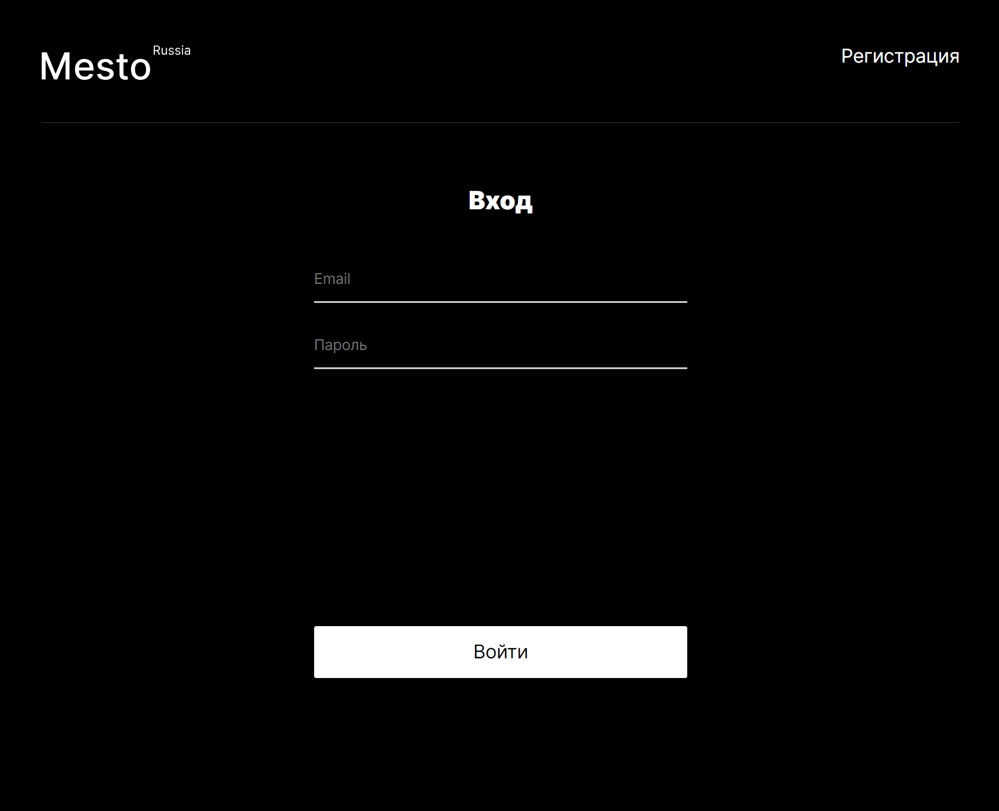

# react-mesto-api-full  

# Проект Mesto (фронтенд + бэкенд)  

В проекте реализованы возможности:

* Регистрация / авторизация пользователя  
* Изменение информации о себе  
* Редактирование аватара  
* Добавление / удаление карточки (чужие фото-посты удалять нельзя)  
* Добавление / удаление лайка фото

Репозиторий для приложения проекта `Mesto`, включающий фронтенд и бэкенд части приложения со следующими возможностями: авторизации и регистрации пользователей, операции с карточками и пользователями. Бэкенд расположите в директории `backend/`, а фронтенд - в `frontend/`. 
  
Пожалуйста, прикрепите в это описание ссылку на сайт, размещенный на Яндекс.Облаке.

макет https://www.figma.com/file/5H3gsn5lIGPwzBPby9jAOo/JavaScript.-Sprint-12?type=design&node-id=0-1&mode=design&t=qsMUstsfoY8fXwLT-0

Адрес репозитория: https://github.com/ApostalDante/react-mesto-api-full-gha

**Desktop**
  

**Запуск проекта**
* Для установки всех пакетов: npm i

*Backend:*

* npm lint — запускает проверку линтером
* npm run start — запускает сервер
* npm run dev — запускает сервер с hot-reload

*Frontend:*

* npm run build — запуск проекта в режиме продакшн, с формированием файлов подготовленных к деплою в директории /build
* npm run start — запуск проекта в режиме разработки

## Ссылки на проект

IP 130.193.52.73

Frontend https://levkin.mesto.frontend.nomoredomainsicu.ru

Backend https://levkin.mesto.backend.nomoredomainsicu.ru
